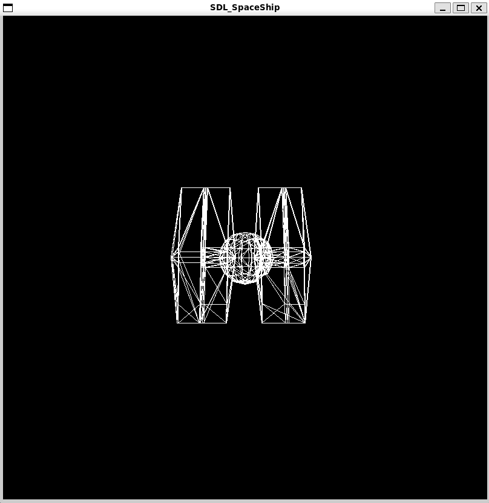
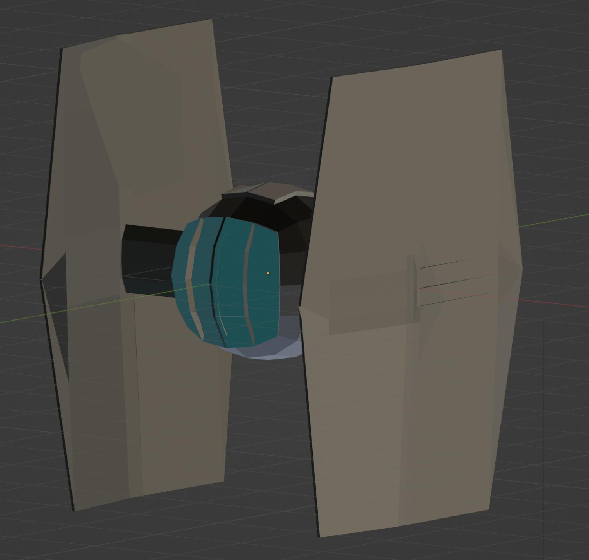

# SR1-CC2018
This program render a spaceship created in Blender into a rendering using CPP, CMAKE, SDL2 and GLM.

## Ubuntu 22.04
Install CPP compilers, CMAKE, SDL2 and GLM-DEV libraries. Then run the following command:

```shell
./run.sh
```


### Rendered StarFighter


### Original Blender StarFighter

